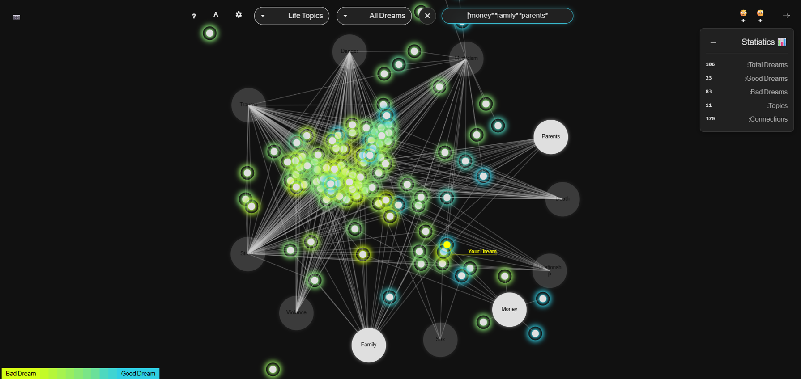

## About

This project was built for my coursework at University of Haifa under the supervision of Prof. Roi Poranne.

## Project Concept

**Dream Catcher** (Atra) is a multidisciplinary art project that explores the collective subconscious by merging personal dreams into a shared visual experience. The project draws inspiration from the "Social Dream Matrix" methodology, developed by Gordon Lawrence in 1982, which examines how individual dreams reflect and shape our collective consciousness.

### How It Works

The system consists of two main components:

1. **Dream Collection Interface (`atra`)**: A web-based form where users can submit their dreams either by writing text or recording audio. All dreams are collected anonymously and stored in a database.

2. **Dream Map Visualization (`play-with-dreams`)**: An interactive physics-based visualization where:
   - Each dream appears as a white dot
   - Topics/themes are represented as large circles (hubs)
   - The connection strength between dreams and topics is visualized by the length of connecting lines (shorter lines = stronger connections)
   - Users can interact with the map by adding topics, dragging them, and hovering over dreams to read them

The visualization uses Matter.js for physics simulation, creating a dynamic, organic representation of how dreams cluster around common themes and topics, revealing patterns in our collective subconscious.

## Improvements and Enhancements

This enhanced version includes several significant improvements over the original:

### Multilingual Support
- **Full trilingual interface**: Complete support for Hebrew, English, and Arabic
- **Automatic translation**: All dreams are automatically translated into all three languages
- **Localized UI**: All interface elements, categories, and navigation are translated
- **Language switching**: Seamless language switching throughout the application

### Advanced Dream Analysis
- **Sentiment analysis**: Dreams are automatically analyzed for emotional tone (good/bad dream value on a 0-10 scale)
- **Automatic theme extraction**: AI-powered extraction of main themes from dream text
- **Enhanced categorization**: Improved connection analysis between dreams and topics using advanced NLP

### Geographic Features
- **City-based filtering**: Dreams can be tagged by city (e.g., Arad and Tel-Aviv) and filtered accordingly
- **City-specific maps**: Support for creating separate map clusters for different cities
- **Dual cluster maps**: Advanced map types that can show dreams from multiple cities side-by-side in a dual cluster visualization

### User Interaction Enhancements
- **Comment system**: Users can add comments to dreams with automatic translation to all supported languages
- **Real-time updates**: WebSocket support for live updates when new dreams or comments are added
- **Improved navigation**: Better routing and navigation between the collection interface and map visualization
- **Keyboard shortcuts**: Comprehensive keyboard shortcuts for navigation and interaction (Space for fullscreen, +/- for zoom, arrows for navigation, F to fit to screen, Esc to close windows)
- **Toast notifications**: User-friendly toast notifications for system feedback and user actions
- **Progress bar**: Visual progress indicators for long-running operations and data loading
- **Search and filter functionality**: Enhanced search and filter capabilities to find specific dreams or topics
- **Map snapshot**: Ability to capture and save snapshots of the current map state

### Visualization Improvements
- **Improved physics engine**: Enhanced Matter.js physics simulation to prevent floating items or dreams, ensuring stable and realistic positioning
- **Statistics dashboard**: Comprehensive statistics dashboard showing dream counts, topic distributions, and other analytics

### Technical Improvements
- **Better server integration**: Improved communication between the two servers
- **Enhanced data processing**: More robust dream processing and connection calculation
- **Translation management**: Automated tools for ensuring all content is properly translated
- **Database optimizations**: Improved data structure and query performance

**Note**: This project is an enhanced version based on [atra-repos](https://github.com/TastySpaceApple/atra-repos).

## Project Structure

There are two main components:

- **`atra`** - Dream collection interface
  - Handles form submission, audio recording, and text input
  - Sends requests to `play-with-dreams` to recalculate the map
  - Runs on port 8000

- **`play-with-dreams`** - Dream map visualization and processing
  - Interactive physics-based map visualization (using Matter.js)
  - Dream analysis and connection calculation jobs
  - API endpoints for dream submission and map updates
  - Runs on port 9000

## Quick Start

**One command to run both servers:**
```bash
npm start
```

Or use the platform-specific scripts:
- **Windows**: `start.bat` (double-click or run in terminal)
- **Mac/Linux**: `./start.sh`

## Installation

1. Clone the repository
2. Install dependencies:
   ```bash
   npm run install-all
   ```
   Or manually:
   ```bash
   cd atra && npm install && cd ../play-with-dreams && npm install
   ```

## Usage

1. Start both servers using `npm start` or the platform-specific scripts
2. Visit `http://localhost:8000` to access the dream collection interface
3. Submit a dream using either the text input or audio recording feature
4. View the dream map at `http://localhost:9000/map`
5. Interact with the map:
   - Right-click to add topics
   - Drag topics to reposition them
   - Hover over dreams to read them
   - Use keyboard shortcuts (Space for fullscreen, +/- for zoom, arrows for navigation)

## Scaffolding

Use scaffolding to generate new files with consistent templates.

### Commands

```bash
npm run scaffold:job <name>
npm run scaffold:route <name>
npm run scaffold:service <name>
npm run scaffold:ui <name>
npm run scaffold:collection <name>
npm run scaffold:atra-route <name>
```

### What each scaffold creates

- `scaffold:job` → `play-with-dreams/jobs/<name>.js` and adds it to `jobs/index.js`
- `scaffold:route` → `play-with-dreams/routes/<name>.routes.js` and registers in `server.js`
- `scaffold:service` → `play-with-dreams/services/<name>.js`
- `scaffold:ui` → `play-with-dreams/client/<name>.html|css|js` and adds a route in `server.js`
- `scaffold:collection` → `play-with-dreams/services/database/<name>.collection.js` and adds it to `datastore.js`
- `scaffold:atra-route` → `atra/frontend/pages/<name>/<name>.html|css|js` and registers a route in `atra/server.routing.js`

### Overwrite existing files

```bash
node scripts/scaffold.js <type> <name> --force
```

## Multi-Tenant + Location Mode (Summary)

- **Multi-tenant routing** via `/t/<tenant>/...` on both servers.
- **Tenant isolation** added to MongoDB reads/writes (per-tenant items, themes, maps, comments, connections).
- **Default tenant** is `demo` when no tenant is provided.
- **Tenant = location** model enabled:
  - City is auto-set from tenant on save.
  - City filter dropdown hidden on the map.

## Related Dreams Highlight (Summary)

- Hover/click a dream to **highlight related dreams** by shared categories.
- **Colored connections** and a **legend** show each category.
- **Non-AI fallback** uses feelings (fear, happiness, etc.) as categories when AI is off.

## Location Picker (Summary)

- Homepage includes a **location picker** (with custom input).
- Labels update for **Hebrew/English/Arabic**.

## Dream Map Visualization


